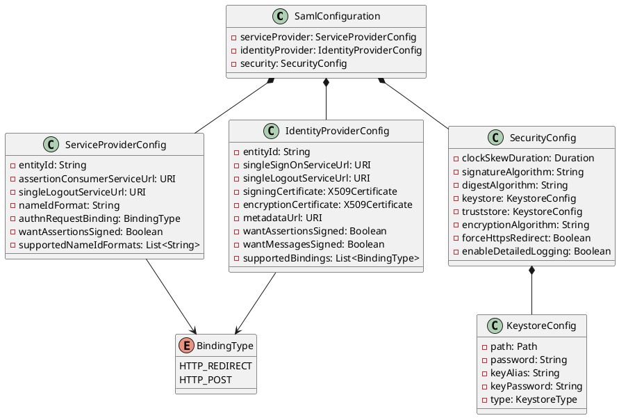
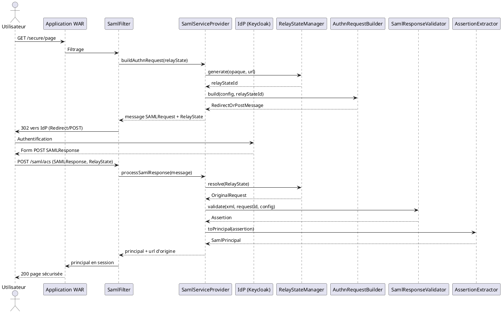
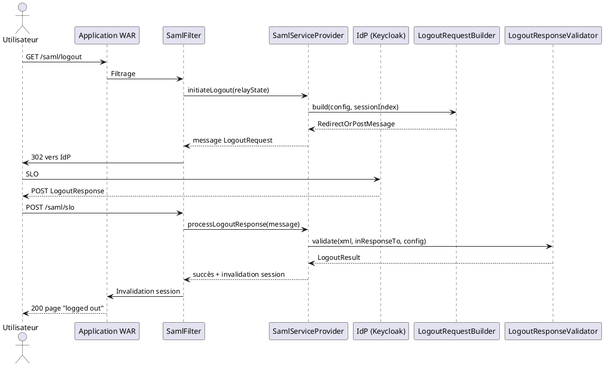
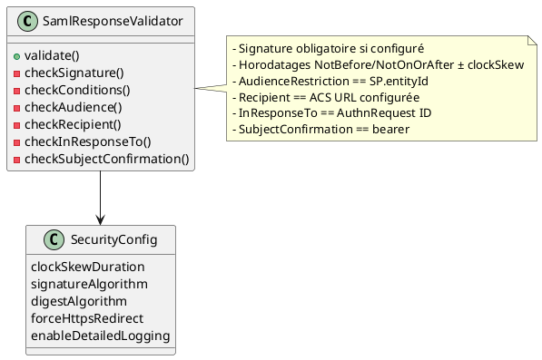
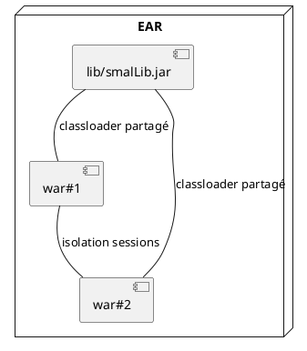

# 🗺️ Conception UML détaillée — SmalLib

Ce document synthétise la conception UML de SmalLib telle que décrite dans `SPECIFICATION.md`. Les diagrammes sont rédigés au format PlantUML (texte) afin d'être compilables, et chaque section est accompagnée d'explications pour guider l'implémentation.

## 1. Vue package / composants

```plantuml
@startuml
package "SmalLib" {
  package "public-api" {
    interface SamlServiceProvider
    interface SamlServiceProviderFactory
    class SamlPrincipal
    class SamlConfiguration
  }

  package "core" {
    package config {
      class SamlConfiguration
      class ServiceProviderConfig
      class IdentityProviderConfig
      class SecurityConfig
      class KeystoreConfig
      enum BindingType
      interface ConfigLoader
      class JsonConfigLoader
      class YamlConfigLoader
      class PropertiesConfigLoader
      class KeycloakMetadataConfigLoader
      class EnvironmentVariableConfigLoader
      class ClasspathResourceConfigLoader
    }
    package saml {
      class AuthnRequestBuilder
      class SamlResponseValidator
      class LogoutRequestBuilder
      class LogoutResponseValidator
      class AssertionExtractor
    }
    package binding {
      class RedirectBindingEncoder
      class PostBindingEncoder
      class RelayStateManager
      interface RelayStateStore
    }
    package security {
      class OpenSamlInitializer
      class SignatureService
      class EncryptionService
      class CredentialResolver
    }
    package metadata {
      class MetadataParser
      class EntityDescriptorCache
    }
    package util {
      class XmlUtils
      class TimeUtils
      class CompressionUtils
      class LoggingUtils
    }
    package integration {
      class SamlFilter
      class JaspiServerAuthModule
      interface SamlAuditLogger
      interface SamlErrorHandler
    }
  }

  package "dependencies (externes)" {
    class OpenSAML
    class "Servlet API" as ServletAPI
    class SLF4J
  }
}

SamlServiceProviderFactory --> SamlServiceProvider
SamlServiceProvider --> SamlPrincipal
SamlServiceProvider --> SamlConfiguration
SamlServiceProvider ..> "core modules"

ConfigLoader <|.. JsonConfigLoader
ConfigLoader <|.. YamlConfigLoader
ConfigLoader <|.. PropertiesConfigLoader
ConfigLoader <|.. KeycloakMetadataConfigLoader
ConfigLoader <|.. EnvironmentVariableConfigLoader
ConfigLoader <|.. ClasspathResourceConfigLoader

RelayStateStore <|.. RelayStateManager
SamlFilter --> SamlServiceProviderFactory
JaspiServerAuthModule --> SamlServiceProviderFactory

OpenSAML ..> security
ServletAPI ..> integration
SLF4J ..> util
@enduml
```

**Commentaires**
- La **Public API** reste stable pour les applications WAR/EAR et encapsule toute dépendance interne.
- Les modules `config`, `saml`, `binding`, `security`, `metadata`, `util`, `integration` sont internes et peuvent évoluer sans casser l'API.
- Les dépendances externes (OpenSAML 4.3+, SLF4J, Servlet API) sont utilisées par les modules internes mais sont abstraites dans l’API publique.

## 2. Vue classe — Modèle de configuration

**Commentaires**
- Les classes reflètent les sections SP/IdP/Sécurité de la spécification et isolent toute dépendance OpenSAML.
- `BindingType` restreint les valeurs aux deux bindings SAML supportés (Redirect/POST).
- Les keystores/truststores sont modélisés par `KeystoreConfig` pour encourager la factorisation.

## 3. Vue classe — Services cœur SAML

```plantuml
@startuml
interface SamlServiceProvider {
  + buildAuthnRequest(relayState: String): RedirectOrPostMessage
  + processSamlResponse(message: HttpMessage): SamlPrincipal
  + initiateLogout(relayState: String): RedirectOrPostMessage
  + processLogoutResponse(message: HttpMessage): LogoutResult
}

class AuthnRequestBuilder {
  + build(config: SamlConfiguration, relayStateId: String): RedirectOrPostMessage
}

class SamlResponseValidator {
  + validate(responseXml: String, requestId: String, config: SamlConfiguration): Assertion
}

class AssertionExtractor {
  + toPrincipal(assertion: Assertion): SamlPrincipal
}

class LogoutRequestBuilder {
  + build(config: SamlConfiguration, sessionIndex: String): RedirectOrPostMessage
}

class LogoutResponseValidator {
  + validate(xml: String, inResponseTo: String, config: SamlConfiguration): LogoutResult
}

class RelayStateManager {
  - store: RelayStateStore
  + generate(relayStateOpaque: String, originalUrl: URI): String
  + resolve(relayStateOpaque: String): OriginalRequest
}

SamlServiceProvider --> AuthnRequestBuilder
SamlServiceProvider --> SamlResponseValidator
SamlServiceProvider --> AssertionExtractor
SamlServiceProvider --> LogoutRequestBuilder
SamlServiceProvider --> LogoutResponseValidator
SamlServiceProvider --> RelayStateManager
RelayStateManager --> RelayStateStore
@enduml
```

**Commentaires**
- `SamlServiceProvider` orchestre le parcours SSO/SLO et délègue les étapes à des builders/validators spécialisés.
- `RelayStateManager` sécurise le `RelayState` opaque (stockage serveur + TTL).
- Les classes builder/validator isolent la logique OpenSAML, facilitant les tests unitaires.

## 4. Vue séquence — AuthnRequest / Response (SSO)

**Commentaires**
- Le `RelayState` est généré et résolu côté serveur, conforme à la checklist sécurité.
- Les validations incluent signature, audience, horodatage, Recipient et `InResponseTo`.

## 5. Vue séquence — Single Logout (SLO)

**Commentaires**
- `LogoutResponseValidator` vérifie `InResponseTo`, signature et horodatage avant d’invalider la session.
- Les bindings HTTP-Redirect ou POST sont réutilisés via les encodeurs/binders du module `binding`.

## 6. Considérations sécurité (diagramme de contraintes)

**Commentaires**
- Le validateur centralise la checklist sécurité fournie dans la spécification.
- Les algorithmes et tolérances sont paramétrés par `SecurityConfig` (RSA-SHA256, SHA-256, skew ±2 min par défaut).

## 7. Intégration WAR/EAR

**Commentaires**
- En WAR seul, `smalLib.jar` est empaqueté dans `WEB-INF/lib/` et la config dans `WEB-INF/classes/`.
- En EAR, `smalLib.jar` vit dans `lib/` avec un classloader partagé ; config et filtres peuvent être mutualisés.

## 8. Extension et backlog v2+

- **EncryptedAssertion** : ajouter `DecryptionService` dans `security` et une option `encryptionAlgorithm` dans `SecurityConfig`.
- **Multi-IdP** : gérer une collection de `IdentityProviderConfig` et un routeur d’IdP (sélection par domaine/paramètre).
- **Assertion cache** : introduire `AssertionCache` (TTL) pour rejouer moins de validations.
- **Audit trail BD** : implémenter `SamlAuditLogger` vers JDBC/NoSQL.
- **Hot-reload config** : watcher sur fichiers ou événement JMX, couplé à `ConfigLoader`.
- **SDK frameworks** : modules `integration-quarkus`, `integration-micronaut` exposant les mêmes interfaces API.

